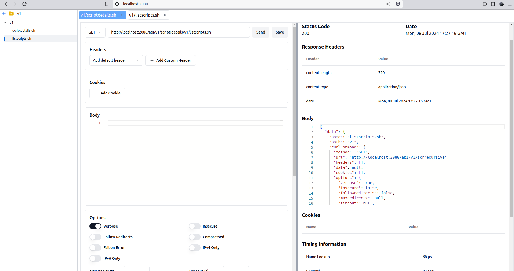

# CurlDock

CurlDock is a lightweight, developer-friendly tool designed to simplify API testing and curl script management. It combines the functionality of curl with the portability of Docker, providing a graphical user interface for creating, editing, and executing curl commands, all within a containerized environment.

## Features

- **Dockerized**: Run in a container for easy deployment and portability
- **User-friendly Interface**: Similar to Postman or Insomnia
- **No Local Installation**: Users don't need to install curl or other tools
- **Git-friendly**: Scripts stored as plain .sh files for version control
- **Network Isolation**: Access endpoints available to the Docker instance

## Core Principles

1. **Simplicity**: CurlDock prioritizes ease of use over complex features.
2. **Local-First**: Primarily designed for use in local development environments.
3. **Git-Friendly**: Integrates well with version control workflows.
4. **No Authentication**: Reduces complexity and improves usability.
5. **Developer Responsibility**: Users are responsible for their own security measures.

## Installation

CurlDock is designed to be easy to use with no installation required. Simply run the following Docker command:

```bash
#!/bin/bash
docker run --name curldock --rm -e SCRIPTSFOLDER="/scripts" -v $(pwd)/scripts:/scripts -e PORT="2080" -p 2080:2080 inigoetxaniz/curldock
```

This command will start CurlDock in a Docker container, mapping the local `scripts` directory to the container and exposing the application on port 2080.

## Configuration

CurlDock can be configured using the following environment variables:

- `SCRIPTSFOLDER`: The directory where curl scripts will be stored and used. In the Docker run command, this is set to "/scripts" and mapped to a local directory.
- `PORT`: The port on which CurlDock will run. In the example, it's set to 2080.

## Usage

After starting the Docker container, you can access the CurlDock interface by opening a web browser and navigating to `http://localhost:2080` (or whatever port you've specified).

The frontend application is similar to other API testing tools like Postman or Insomnia, providing an intuitive interface for creating, editing, and executing curl commands.



## Architecture

CurlDock consists of two main components:

1. **Rust Backend**:
   - Manages all endpoints
   - Implements API logic
   - Serves the Single Page Application (SPA) in production mode
   - Acts as a reverse proxy for different types of requests

2. **React Frontend**:
   - Single Page Application (SPA)
   - Provides a user interface for interacting with curl commands
   - Allows creation, editing, and execution of curl commands
   - Displays results in a user-friendly format

## Security Considerations

- CurlDock does not implement authentication by design.
- It is intended for use in controlled, local environments.
- Users are responsible for ensuring their CurlDock instance is not exposed to untrusted networks.
- Sensitive information should be managed through environment variables or secure vaults, not hardcoded in scripts.

## License

CurlDock is released under the MIT License.

